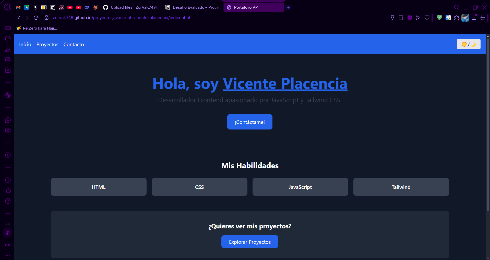

# 🌐 Portafolio Web Personal – Vicente Placencia

Este es un proyecto personal desarrollado como parte del desafío evaluado del curso. El sitio está creado utilizando **HTML**, **Tailwind CSS** y **JavaScript** puro. Representa un portafolio personal que incluye una presentación, una sección de proyectos y un formulario de contacto con validación.

---

## 📄 Estructura del Proyecto

El sitio está compuesto por **tres páginas HTML enlazadas entre sí**:

- `index.html` – Página principal de bienvenida con presentación personal.
- `proyectos.html` – Galería de proyectos personales con filtro por categoría.
- `contacto.html` – Formulario funcional de contacto con validación en JavaScript.

---

## 🛠️ Tecnologías Utilizadas

- **Tailwind CSS (vía CDN)** – Para un diseño moderno, responsive y limpio.
- **JavaScript Vanilla** – Para manejar eventos, validaciones de formularios, modo oscuro y lógica dinámica.
- **HTML5 Semántico**

---

## ✨ Funcionalidades JavaScript

Este proyecto incluye al menos **cinco funciones JavaScript** aplicadas directamente al DOM:

1. **Validación del formulario de contacto** (nombre, email y mensaje)
2. **Modo oscuro personalizado** con botón de alternancia y persistencia en `localStorage`
3. **Filtrado de proyectos por categoría** (todos, web, JavaScript)
4. **Botón "Ver más" que muestra u oculta contenido adicional**
5. **Contador de visitas** en la página de inicio utilizando `localStorage`

Todo el código JavaScript se encuentra **comentado** para facilitar su comprensión.

---

## 📷 Captura de pantalla

> 
